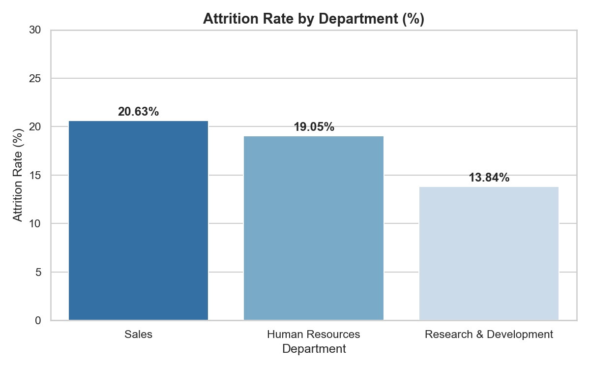
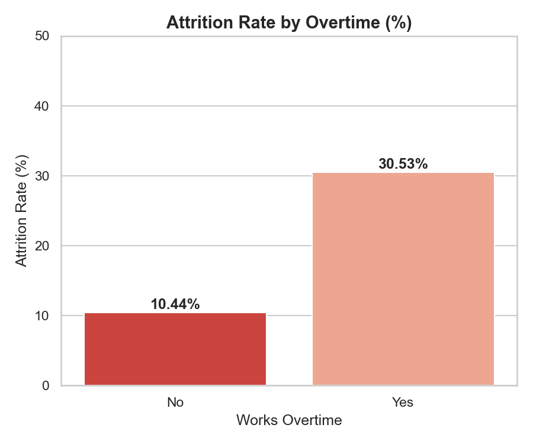
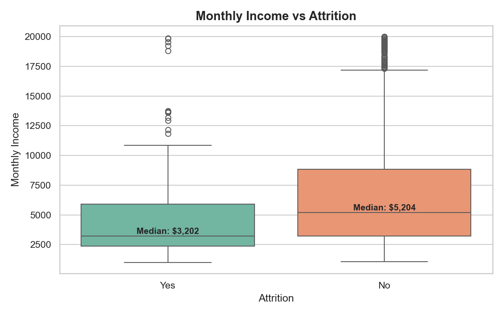
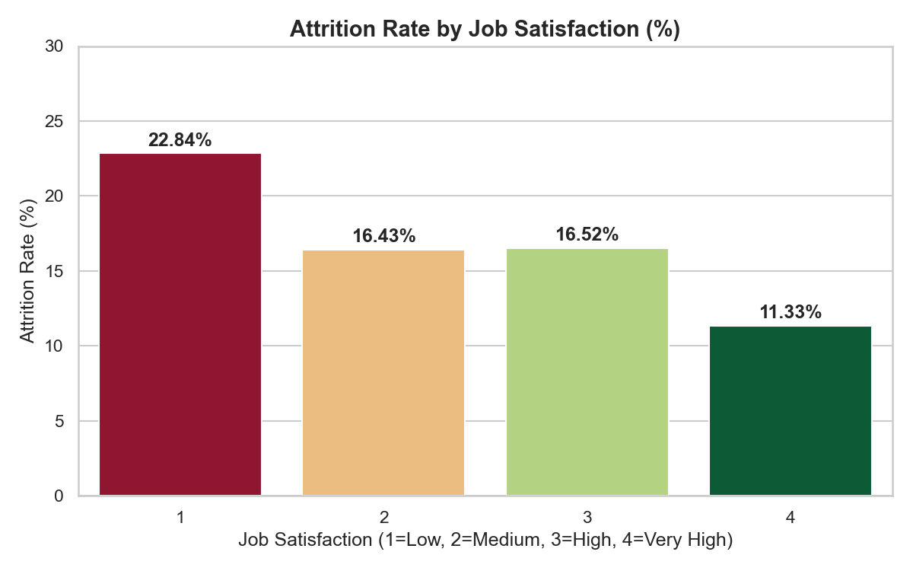
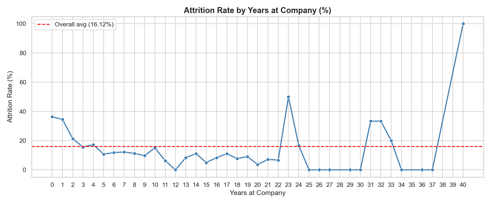
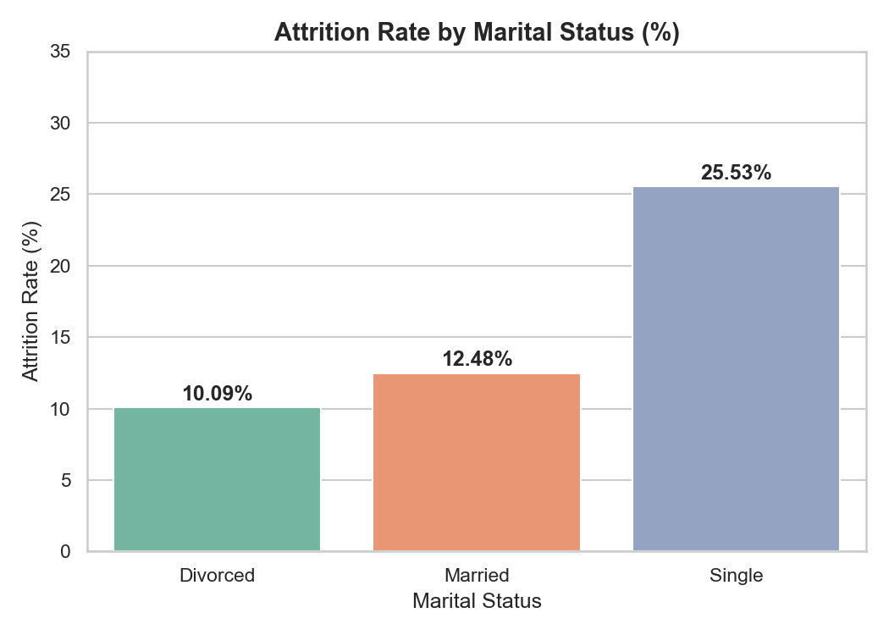

# Employee Attrition Analysis
**Tools:** Python, Pandas, Matplotlib, Seaborn, Tableau  
**Dataset:** [IBM HR Analytics Dataset](https://www.kaggle.com/datasets/pavansubhasht/ibm-hr-analytics-attrition-dataset) — 1,470 employees, 35 features
**Domain:** HR Analytics | Consulting

## Objective
Identify the key drivers of employee attrition at IBM and provide 
actionable recommendations to reduce turnover from its current 
rate of 16.12% — above the industry benchmark of 10–12%.

## Key Findings
| Finding | Value |
|---|---|
| Overall Attrition Rate | 16.12% |
| Highest Risk Department | Sales (20.63%) |
| Overtime vs No Overtime | 30.53% vs 10.44% |
| Low vs High Job Satisfaction | 22.84% vs 11.33% |
| Single vs Married Employees | 25.53% vs 12.48% |
| Highest Risk Tenure Period | Year 0–1 (35%+ attrition) |
| Median Income: Left vs Stayed | $3,202 vs $5,204 |

## Business Recommendations
1. **Reduce overtime in Sales** — overtime is the strongest attrition 
predictor, driving a 3x higher leaving rate
2. **Review entry-level compensation** — employees who left earned 
38% less than those who stayed
3. **Strengthen onboarding** — over a third of employees leave within 
their first year
4. **Conduct satisfaction surveys** — low satisfaction doubles attrition risk
5. **Targeted retention for single employees** — career growth and 
learning opportunities matter more than compensation for this group

## Project Structure
```
01-Employee-Attrition/
├── data/
│   └── WA_Fn-UseC_-HR-Employee-Attrition.csv
├── notebooks/
│   ├── attrition_analysis.ipynb
│   └── chart1-6 (PNG files)
└── README.md
```

## Charts





